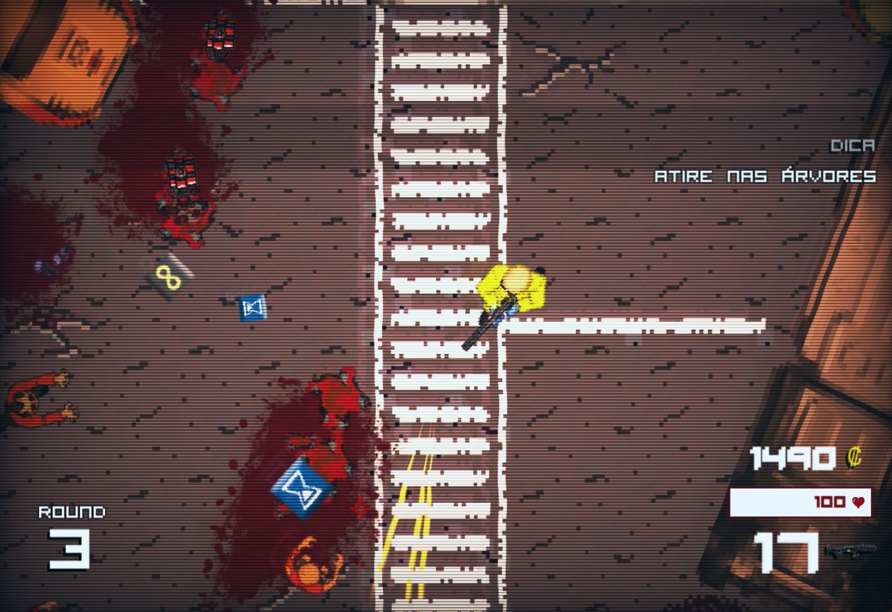
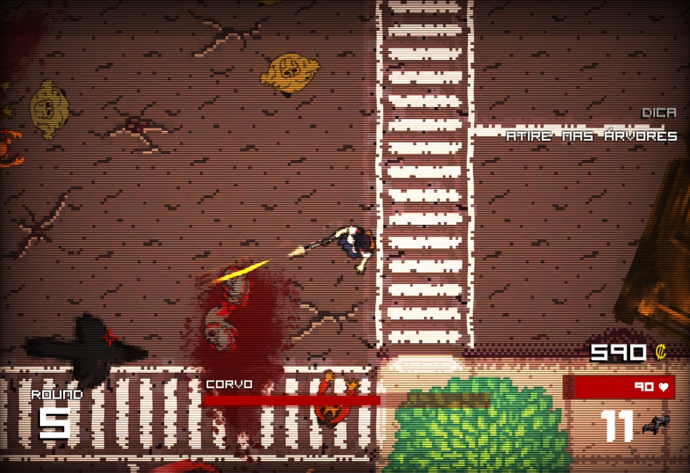
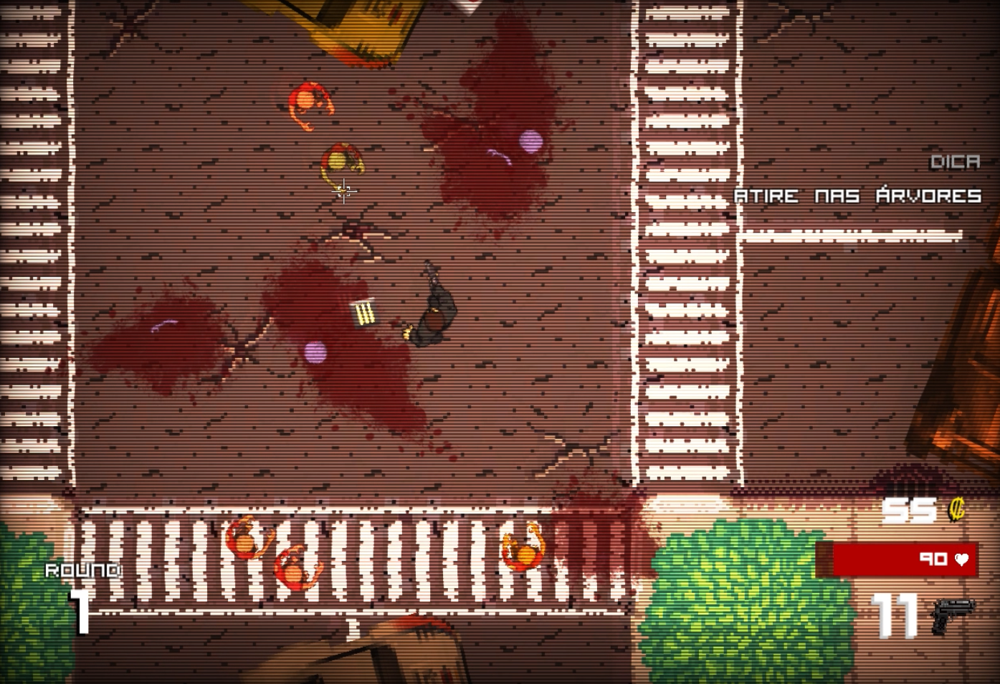

# Die Zombit

In a world overrun by zombies, you must survive as long as possible and defeat different bosses while unlocking weapons, upgrades, equipment, characters, maps and much more. Reviving the classics of the '80s and '90s, Die Zombit is a retro wave top-down shooting game with an amazing soundtrack and addictive gameplay that guarantees many hours of fun. Check out its trailer [here](https://www.youtube.com/watch?v=sO7FSZ3TJns).

    

 

I made this game during my first year in the Computer Science course. I've learned a lot from this project, from software engineering to game design and a little bit of pixel art. I believe the project could be significantly improved using better design patterns, clearer abstractions and algorithmic complexity in mind. Yet, it is a fun game that you can [download](https://play.google.com/store/apps/details?id=com.elitgames.zombit) (an older version) in Play Store.

## Usage

### Running a pre-built binary (Android and Windows only)

For the Android version, you may [head to the Play Store](https://play.google.com/store/apps/details?id=com.elitgames.zombit).

For the Windows version, do the following:
- Download Die.Zombit.[version].zip from the [latest release](https://github.com/bryanoliveira/unity-zombit/releases)
- Extract the game folder
- Double click to run it.

### Building/running from source

-   Install Unity3D (tested for v2019.3)
-   Open the project folder
-   Hit Play and have fun!

## Next steps

This version is an unfinished project that rethinks the UI, weapon management and overall objectives. It was made as an indie game event demo and some things are broken. The fixes and new features I plan to add include:

-   Fix joystick and touchscreen support
-   Fix pause menu UI
-   Fix end game UI
-   Add multiplayer support

 

## Screenshots & more GIFs

  

     
     
    

 

## Credits

-   Soundtracks by
    -   [Bossfight](https://soundcloud.com/bossfightswe)
    -   [Ultrasyd](https://soundcloud.com/ultrasyd)
    -   [Dunderpatrullen](https://soundcloud.com/dunderpatrullen)
    -   [Detious](https://soundcloud.com/detiouss) & [Lockyn](https://soundcloud.com/lockyn)
